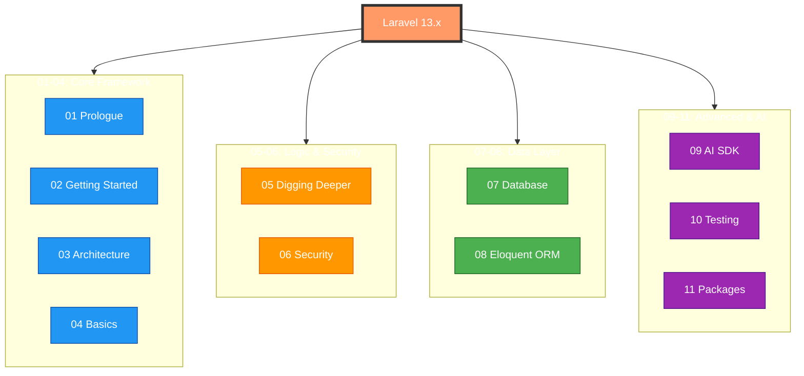

<div align="center">

# 🧠 Laravel 13.x Obsidian Second Brain
### *Transforming static documentation into an interactive knowledge graph.*

[](https://laravel.com)
[](https://obsidian.md)
[](./LICENSE)
[](#-ai-intelligence-integration)

</div>

---

## 📽️ Visual Experience


*A high-definition visualization of the Laravel 13.x ecosystem within Obsidian's Graph View.*

---

## 🔥 Why use this as your Second Brain?

Standard documentation is linear. Your brain isn't. This vault converts the entire **Laravel 13.x documentation** into a interconnected web of knowledge, specifically optimized for:

| Feature | Description |
| :--- | :--- |
| 🔗 **Deep Linking** | Every cross-reference is a `[[wiki-link]]`, allowing instant navigation. |
| 🗺️ **Visual Discovery** | Use the **Graph View** to see how Middleware, Controllers, and Routing intersect. |
| 🤖 **AI-Native** | Pre-formatted YAML frontmatter makes it the perfect context for AI coding assistants. |
| ⚡ **Offline Access** | Zero-latency, fully searchable documentation that works without an internet connection. |
| 🎨 **Themed Hierarchies** | Color-coded nodes for Core Framework, Data Layer, Logic, and AI modules. |

---

## 🗺️ Architectural Map



---

## 🚀 Get Started in 60 Seconds

### Method 1: Git (Recommended)
```bash
git clone https://github.com/scorpikhemraj/laravel-13.x-obsidian-second-brain.git
```

### Method 2: Direct Download
1.  [Download the latest ZIP](https://github.com/scorpikhemraj/laravel-13.x-obsidian-second-brain/archive/refs/heads/main.zip)
2.  Extract the folder.
3.  Open Obsidian and select **"Open folder as vault"**.

---

## 🧠 AI Intelligence Integration

This vault is more than just notes; it's a **Context Engine** for your AI workflow.

### Using with GitHub Copilot / Cursor
Point your AI to the `.md` files in this vault to give it deep knowledge of Laravel 13.x specifics, such as:
- The new **AI SDK** implementation details.
- Optimization patterns for **PHP 8.4** features used in Laravel 13.
- Advanced **Eloquent** relationship patterns.

### Using with Obsidian AI Plugins
If you use plugins like *Smart Connections* or *Text Generator*, this vault provides the high-quality RAG (Retrieval-Augmented Generation) source needed for accurate answers.

---

## 🤖 Agent-Driven Product Development

This vault includes a pre-configured **Laravel Development System** powered by 22 specialized AI agents. This system is designed to take a product idea from concept to production-ready code.

### 📂 Folder Structure
- **[[.skills/|📁 .skills/]]**: High-level capabilities (e.g., `laravel-architecture`, `laravel-backend`) that coordinate specific agents.
- **[[.agents/|📁 .agents/]]**: Specialized AI worker personas with defined roles, tools, and workflows.

### 🚀 Product Creation Workflow
The agents follow a 5-step chain to build features or entire products:

| Step | Phase | Key Agents Involved |
| :--- | :--- | :--- |
| **1** | **Planning** | `product-manager`, `system-architect` |
| **2** | **Logic** | `database-engineer`, `backend-developer` |
| **3** | **UI/UX** | `frontend-developer` |
| **4** | **Stability** | `security-engineer`, `test-engineer` |
| **5** | **Delivery** | `code-reviewer`, `devops-engineer`, `docs-writer` |

For more details on how to trigger this system, refer to the root **[[SKILL.md]]**.

---

## 📚 Table of Contents

<details>
<summary>📂 Click to expand full documentation tree</summary>

### 01. Prologue
- [Release Notes](./laravel-13.x/01-prologue/01-release-notes.md)
- [Upgrade Guide](./laravel-13.x/02-upgrade-guide.md)
- [Contribution Guide](./laravel-13.x/01-prologue/03-contribution-guide.md)

### 02. Getting Started
- [Installation](./laravel-13.x/02-getting-started/01-installation.md)
- [Configuration](./laravel-13.x/02-getting-started/02-configuration.md)
- [AI Assisted Development](./laravel-13.x/02-getting-started/03-ai-assisted-development.md)
- [Directory Structure](./laravel-13.x/02-getting-started/04-directory-structure.md)
- [Frontend](./laravel-13.x/02-getting-started/05-frontend.md)
- [Starter Kits](./laravel-13.x/02-getting-started/06-starter-kits.md)
- [Deployment](./laravel-13.x/02-getting-started/07-deployment.md)

### 03. Architecture Concepts
- [Request Lifecycle](./laravel-13.x/03-architecture-concepts/01-request-lifecycle.md)
- [Service Container](./laravel-13.x/03-architecture-concepts/02-service-container.md)
- [Service Providers](./laravel-13.x/03-architecture-concepts/03-service-providers.md)
- [Facades](./laravel-13.x/03-architecture-concepts/04-facades.md)

### 04. The Basics
- [Routing](./laravel-13.x/04-the-basics/01-routing.md) | [Middleware](./laravel-13.x/04-the-basics/02-middleware.md) | [Controllers](./laravel-13.x/04-the-basics/04-controllers.md)
- [HTTP Requests](./laravel-13.x/04-the-basics/05-http-requests.md) | [HTTP Responses](./laravel-13.x/04-the-basics/06-http-responses.md) | [Views](./laravel-13.x/04-the-basics/07-views.md)
- [Blade Templates](./laravel-13.x/04-the-basics/08-blade-templates.md) | [Validation](./laravel-13.x/04-the-basics/12-validation.md) | [Logging](./laravel-13.x/04-the-basics/14-logging.md)

### 05. Digging Deeper
- [Artisan Console](./laravel-13.x/05-digging-deeper/01-artisan-console.md)
- [Concurrency](./laravel-13.x/05-digging-deeper/05-concurrency.md)
- [Context](./laravel-13.x/05-digging-deeper/06-context.md)
- [Queues](./laravel-13.x/05-digging-deeper/17-queues.md)
- [Task Scheduling](./laravel-13.x/05-digging-deeper/21-task-scheduling.md)

### 07. Database & Eloquent
- [Migrations](./laravel-13.x/07-database/04-migrations.md)
- [Query Builder](./laravel-13.x/07-database/02-query-builder.md)
- [Eloquent Relationships](./laravel-13.x/08-eloquent-orm/02-eloquent-relationships.md)
- [API Resources](./laravel-13.x/08-eloquent-orm/05-eloquent-api-resources.md)

### 09. AI & Advanced
- [Laravel AI SDK](./laravel-13.x/09-ai/01-laravel-ai-sdk.md)
- [Laravel MCP](./laravel-13.x/09-ai/02-laravel-mcp.md)
- [Laravel Boost](./laravel-13.x/09-ai/03-laravel-boost.md)

### 🤖 AI Agents & Skills
- **[[SKILL.md|Master Development System]]**
- **[[.skills/|Browse Skills]]**
- **[[.agents/|Browse Agents]]**

</details>

---

## ⭐ Support the Project

If this "Second Brain" helps you build better Laravel applications, please consider:
- **Starring** the repository on GitHub.
- Sharing it with other Laravel developers.
- Contributing by improving the expert notes!

---

<div align="center">
    Made with ❤️ for the Laravel Community.
</div>