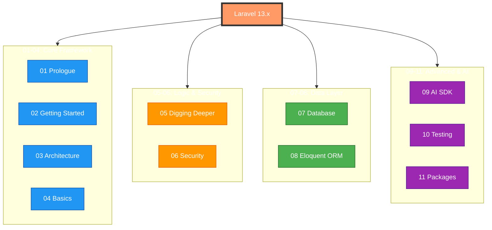

# 🧠 Laravel 13.x Obsidian Second Brain

[](https://laravel.com)
[](https://obsidian.md)
[](#-ai-second-brain-integration)

The ultimate, pre-configured **Obsidian Vault** for Laravel 13.x. This is not just documentation; it's a structured knowledge graph designed to work as your **AI Second Brain**.

---

## ✨ Key Features

- 🔗 **Bi-Directional Linking**: All documentation cross-references have been converted from web URLs to Obsidian internal links (`[[...]]`).
- 🎨 **Level-Wise Visualization**: Color-coded hierarchy (Core, Logic, Data, AI) with pre-configured tags for the Obsidian Graph View.
- 🤖 **AI-Optimized**: Highly structured content with YAML frontmatter, perfect for RAG (Retrieval Augmented Generation) and AI plugins like *Copilot* or *Smart Connections*.
- 🛠️ **Expert Annotations**: Includes "Laravel Expert Notes" on 13.x specific features like `chaperone()`, `#[Singleton]` attributes, and the new AI SDK.

---

## 🗺️ Architectural Map



---

## 🚀 Getting Started

1.  **Clone this repository**:
    ```bash
    git clone https://github.com/scorpikhemraj/laravel-13.x-obsidian-second-brain.git
    ```
2.  **Open in Obsidian**: Open the cloned folder as a new vault in Obsidian.
3.  **Setup Colors**: In Graph View settings, add groups for tags `#framework`, `#data`, `#logic`, and `#ai` to see the color-coded relationship map.

---

## 🤖 AI Second Brain Integration

This vault is designed to be the primary context source for your AI coding partner. 

*   **Prompt Engineering**: Use the linked architecture files as context when asking your AI to build new Laravel features.
*   **Knowledge Retrieval**: If using a RAG-based AI plugin, this vault provides clean, markdown-native documentation that LLMs can parse with high accuracy.

---

## 📚 Table of Contents

### 01. Prologue

- [Release Notes](./01-prologue/01-release-notes.md)
- [Upgrade Guide](./01-prologue/02-upgrade-guide.md)
- [Contribution Guide](./01-prologue/03-contribution-guide.md)

### 02. Getting Started

- [Installation](./02-getting-started/01-installation.md)
- [Configuration](./02-getting-started/02-configuration.md)
- [AI Assisted Development](./02-getting-started/03-ai-assisted-development.md)
- [Directory Structure](./02-getting-started/04-directory-structure.md)
- [Frontend](./02-getting-started/05-frontend.md)
- [Starter Kits](./02-getting-started/06-starter-kits.md)
- [Deployment](./02-getting-started/07-deployment.md)

### 03. Architecture Concepts

- [Request Lifecycle](./03-architecture-concepts/01-request-lifecycle.md)
- [Service Container](./03-architecture-concepts/02-service-container.md)
- [Service Providers](./03-architecture-concepts/03-service-providers.md)
- [Facades](./03-architecture-concepts/04-facades.md)

### 04. The Basics

- [Routing](./04-the-basics/01-routing.md)
- [Middleware](./04-the-basics/02-middleware.md)
- [CSRF Protection](./04-the-basics/03-csrf-protection.md)
- [Controllers](./04-the-basics/04-controllers.md)
- [HTTP Requests](./04-the-basics/05-http-requests.md)
- [HTTP Responses](./04-the-basics/06-http-responses.md)
- [Views](./04-the-basics/07-views.md)
- [Blade Templates](./04-the-basics/08-blade-templates.md)
- [Asset Bundling (Vite)](./04-the-basics/09-asset-bundling-vite.md)
- [URL Generation](./04-the-basics/10-url-generation.md)
- [HTTP Session](./04-the-basics/11-http-session.md)
- [Validation](./04-the-basics/12-validation.md)
- [Error Handling](./04-the-basics/13-error-handling.md)
- [Logging](./04-the-basics/14-logging.md)

### 05. Digging Deeper

- [Artisan Console](./05-digging-deeper/01-artisan-console.md)
- [Broadcasting](./05-digging-deeper/02-broadcasting.md)
- [Cache](./05-digging-deeper/03-cache.md)
- [Collections](./05-digging-deeper/04-collections.md)
- [Concurrency](./05-digging-deeper/05-concurrency.md)
- [Context](./05-digging-deeper/06-context.md)
- [Contracts](./05-digging-deeper/07-contracts.md)
- [Events](./05-digging-deeper/08-events.md)
- [File Storage](./05-digging-deeper/09-file-storage.md)
- [Helpers](./05-digging-deeper/10-helpers.md)
- [HTTP Client](./05-digging-deeper/11-http-client.md)
- [Localization](./05-digging-deeper/12-localization.md)
- [Mail](./05-digging-deeper/13-mail.md)
- [Notifications](./05-digging-deeper/14-notifications.md)
- [Package Development](./05-digging-deeper/15-package-development.md)
- [Processes](./05-digging-deeper/16-processes.md)
- [Queues](./05-digging-deeper/17-queues.md)
- [Rate Limiting](./05-digging-deeper/18-rate-limiting.md)
- [Search](./05-digging-deeper/19-search.md)
- [Strings](./05-digging-deeper/20-strings.md)
- [Task Scheduling](./05-digging-deeper/21-task-scheduling.md)

### 06. Security

- [Authentication](./06-security/01-authentication.md)
- [Authorization](./06-security/02-authorization.md)
- [Email Verification](./06-security/03-email-verification.md)
- [Encryption](./06-security/04-encryption.md)
- [Hashing](./06-security/05-hashing.md)
- [Password Reset](./06-security/06-password-reset.md)

### 07. Database

- [Getting Started](./07-database/01-database-getting-started.md)
- [Query Builder](./07-database/02-query-builder.md)
- [Pagination](./07-database/03-pagination.md)
- [Migrations](./07-database/04-migrations.md)
- [Seeding](./07-database/05-seeding.md)
- [Redis](./07-database/06-redis.md)
- [MongoDB](./07-database/07-mongodb.md)

### 08. Eloquent ORM

- [Getting Started](./08-eloquent-orm/01-eloquent-getting-started.md)
- [Relationships](./08-eloquent-orm/02-eloquent-relationships.md)
- [Collections](./08-eloquent-orm/03-eloquent-collections.md)
- [Mutators / Casts](./08-eloquent-orm/04-eloquent-mutators-casts.md)
- [API Resources](./08-eloquent-orm/05-eloquent-api-resources.md)
- [Serialization](./08-eloquent-orm/06-eloquent-serialization.md)
- [Factories](./08-eloquent-orm/07-eloquent-factories.md)

### 09. AI

- [Laravel AI SDK](./09-ai/01-laravel-ai-sdk.md)
- [Laravel MCP](./09-ai/02-laravel-mcp.md)
- [Laravel Boost](./09-ai/03-laravel-boost.md)

### 10. Testing

- [Getting Started](./10-testing/01-testing-getting-started.md)
- [HTTP Tests](./10-testing/02-http-tests.md)
- [Console Tests](./10-testing/03-console-tests.md)
- [Laravel Dusk](./10-testing/04-laravel-dusk.md)
- [Database Testing](./10-testing/05-database-testing.md)
- [Mocking](./10-testing/06-mocking.md)

### 11. Packages

- [Cashier (Stripe)](./11-packages/01-cashier-stripe.md)
- [Cashier (Paddle)](./11-packages/02-cashier-paddle.md)
- [Dusk](./11-packages/03-laravel-dusk.md)
- [Envoy](./11-packages/04-laravel-envoy.md)
- [Fortify](./11-packages/05-laravel-fortify.md)
- [Folio](./11-packages/06-laravel-folio.md)
- [Homestead](./11-packages/07-laravel-homestead.md)
- [Horizon](./11-packages/08-laravel-horizon.md)
- [Mix](./11-packages/09-laravel-mix.md)
- [Octane](./11-packages/10-laravel-octane.md)
- [Passport](./11-packages/11-laravel-passport.md)
- [Pennant](./11-packages/12-laravel-pennant.md)
- [Pint](./11-packages/13-laravel-pint.md)
- [Precognition](./11-packages/14-precognition.md)
- [Prompts](./11-packages/15-prompts.md)
- [Pulse](./11-packages/16-laravel-pulse.md)
- [Reverb](./11-packages/17-laravel-reverb.md)
- [Sail](./11-packages/18-laravel-sail.md)
- [Sanctum](./11-packages/19-laravel-sanctum.md)
- [Scout](./11-packages/20-laravel-scout.md)
- [Socialite](./11-packages/21-laravel-socialite.md)
- [Telescope](./11-packages/22-laravel-telescope.md)
- [Valet](./11-packages/23-laravel-valet.md)

---

## 🔗 Quick Links

- [Official Laravel Documentation](https://laravel.com/docs/13.x)
- [Laravel API Documentation](https://api.laravel.com)
- [Laravel Releases](https://github.com/laravel/framework/releases)